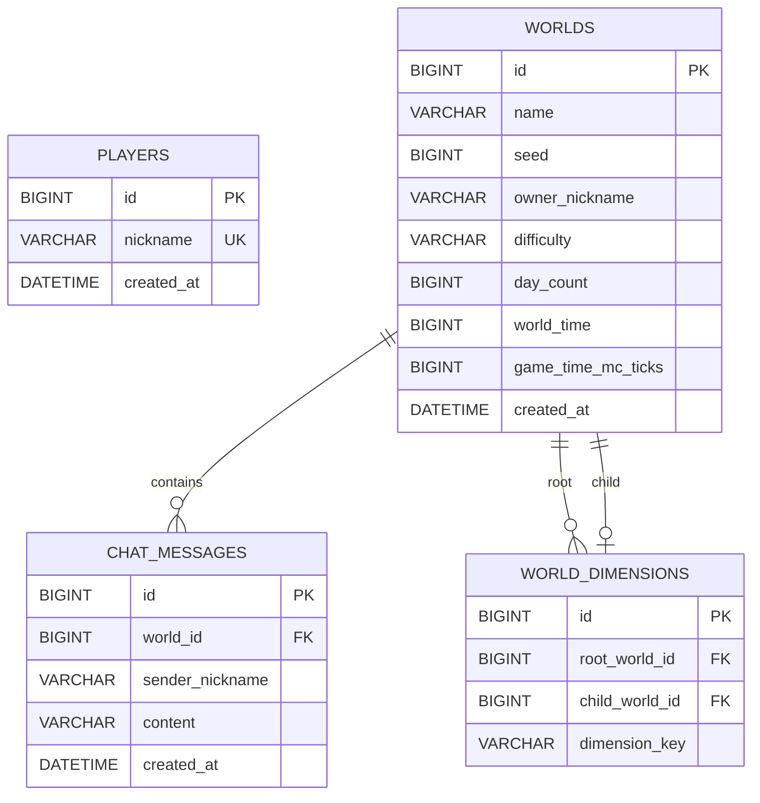

# Game Spring Expert Assignment

Spring Boot 기반 멀티플레이 게임 서버 과제입니다. MySQL에는 플레이어·월드·채팅을 저장하고, Redis에는 접속 상태를 저장합니다. REST API는 플레이어와 월드 관리 및 최근 채팅 조회를 담당하며, WebSocket은 실시간 이동·채팅·접속자 조회를 담당합니다.

> 이 문서는 현재 완료된 Lv 1~15의 외부 API를 기준으로 작성했습니다. 아직 구현 중인 채팅 history, cache 등 후속 단계의 API는 포함하지 않았습니다.

## 기술 구성

- Java 21, Spring Boot 4.1.0
- Spring MVC, Spring WebSocket, Spring Data JPA, Bean Validation
- MySQL 8.4, Redis 7
- Gradle

## API 공통 규칙

- REST Base URL: `http://localhost:8080`
- WebSocket Base URL: `ws://localhost:8080`
- 요청과 응답의 기본 형식은 JSON입니다.
- 날짜와 시간은 `2026-09-22T10:30:00` 형태의 ISO-8601 문자열입니다.
- REST API 오류는 다음 형식으로 반환됩니다.

```json
{
  "error": "ERROR_CODE"
}
```

## REST API 명세

| Method | Endpoint | 기능 | 성공 응답 |
| --- | --- | --- | --- |
| `POST` | `/players` | 플레이어 등록 | `201 Created` |
| `GET` | `/worlds` | 월드 목록 조회 | `200 OK` |
| `POST` | `/worlds` | 월드 생성 | `201 Created` |
| `DELETE` | `/worlds/{id}` | 월드 삭제 | `204 No Content` |
| `DELETE` | `/worlds/{id}/if-matches` | 생성 정보가 일치할 때 월드 삭제 | `204 No Content` |
| `GET` | `/worlds/{worldId}/chats` | 최근 채팅 조회 | `200 OK` |

### 플레이어 등록

`POST /players`

닉네임으로 플레이어를 등록합니다. 닉네임은 영문 대소문자, 숫자, `_`만 사용할 수 있으며 길이는 2~12자입니다.

요청:

```json
{
  "nickname": "player1"
}
```

성공 응답은 body가 없는 `201 Created`입니다.

| Status | error | 발생 조건 |
| --- | --- | --- |
| `400 Bad Request` | `VALIDATION_FAILED` | 닉네임 형식이 조건에 맞지 않음 |
| `400 Bad Request` | `INVALID_REQUEST_BODY` | JSON 형식이 잘못됨 |
| `409 Conflict` | `DUPLICATE_NICKNAME` | 이미 사용 중인 닉네임 |

### 월드 목록 조회

`GET /worlds`

Dimension child가 아닌 root world를 ID 오름차순으로 조회합니다. `onlineCount`는 Redis에 저장된 현재 접속 상태를 기준으로 계산합니다.

응답:

```json
[
  {
    "id": 1,
    "name": "First World",
    "seed": 123456,
    "onlineCount": 2,
    "difficulty": "normal"
  }
]
```

| Status | error | 발생 조건 |
| --- | --- | --- |
| `503 Service Unavailable` | `WORLD_BASELINE_INITIALIZING` | 월드 baseline 초기화가 완료되지 않음 |

### 월드 생성

`POST /worlds`

root world는 최대 3개까지 생성할 수 있습니다. `difficulty`와 `nickname`은 선택값이며, `nickname`을 전달했다면 등록된 플레이어여야 합니다.

요청:

```json
{
  "name": "First World",
  "difficulty": "normal",
  "nickname": "player1"
}
```

| Field | Type | 필수 | 조건 |
| --- | --- | --- | --- |
| `name` | String | O | 공백이 아닌 1~30자 |
| `difficulty` | String | X | `easy`, `normal`, `hard`; 생략 시 기본 난이도 |
| `nickname` | String | X | 2~12자, 전달 시 등록된 플레이어여야 함 |
| `debugSeed` | Number | X | QA seeding 전용 signed 32-bit integer |

응답:

```json
{
  "id": 1,
  "name": "First World",
  "seed": 123456,
  "difficulty": "normal",
  "ownerNickname": "player1"
}
```

`debugSeed`는 `game.qa-seeding=true`인 QA 환경에서만 허용됩니다. 허용된 `debugSeed`로 생성하면 응답에 `X-Game-Expert-Qa-World-Creation-Receipt` header가 추가됩니다.

| Status | error | 발생 조건 |
| --- | --- | --- |
| `400 Bad Request` | `VALIDATION_FAILED` | 요청값 검증 실패 |
| `400 Bad Request` | `INVALID_REQUEST_BODY` | JSON·enum 형식이 잘못됐거나 일반 환경에서 `debugSeed`를 요청함 |
| `404 Not Found` | `PLAYER_NOT_FOUND` | 존재하지 않는 소유자 닉네임 |
| `409 Conflict` | `WORLD_LIMIT_REACHED` | root world가 이미 3개 존재함 |
| `503 Service Unavailable` | `WORLD_BASELINE_INITIALIZING` | 월드 baseline 초기화가 완료되지 않음 |

### 월드 삭제

`DELETE /worlds/{id}?nickname={nickname}`

요청자의 닉네임으로 삭제 권한을 확인한 뒤 월드와 관련 데이터를 삭제합니다.

```http
DELETE /worlds/1?nickname=player1
```

| Status | error | 발생 조건 |
| --- | --- | --- |
| `403 Forbidden` | `NOT_WORLD_OWNER` | 요청자 확인 실패 또는 삭제 권한 없음 |
| `404 Not Found` | `WORLD_NOT_FOUND` | root world가 존재하지 않음 |
| `503 Service Unavailable` | `WORLD_BASELINE_INITIALIZING` | 월드 baseline 초기화가 완료되지 않음 |

### 생성 정보가 일치할 때 월드 삭제

`DELETE /worlds/{id}/if-matches?nickname={nickname}`

삭제 권한과 함께 현재 월드의 생성 정보가 요청 body와 모두 일치하는지 확인합니다.

요청:

```json
{
  "name": "First World",
  "seed": 123456,
  "difficulty": "normal",
  "ownerNickname": "player1"
}
```

| Status | error | 발생 조건 |
| --- | --- | --- |
| `400 Bad Request` | `VALIDATION_FAILED` | 요청값 검증 실패 |
| `403 Forbidden` | `NOT_WORLD_OWNER` | 요청자 확인 실패 또는 삭제 권한 없음 |
| `404 Not Found` | `WORLD_NOT_FOUND` | root world가 존재하지 않음 |
| `409 Conflict` | `WORLD_IDENTITY_MISMATCH` | 이름·seed·난이도·소유자 중 하나 이상 불일치 |
| `503 Service Unavailable` | `WORLD_BASELINE_INITIALIZING` | 월드 baseline 초기화가 완료되지 않음 |

### 최근 채팅 조회

`GET /worlds/{worldId}/chats?limit={limit}`

지정한 월드의 최근 채팅을 조회합니다. Database에서는 최신 메시지부터 조회한 뒤, 응답은 오래된 메시지부터 최신 메시지 순서로 반환합니다.

| Parameter | 필수 | 기본값 | 처리 방식 |
| --- | --- | --- | --- |
| `worldId` | O | - | 조회할 월드 ID |
| `limit` | X | `50` | `1~100` 범위로 보정 |

응답:

```json
[
  {
    "sender": "player1",
    "content": "안녕하세요.",
    "createdAt": "2026-09-22T10:30:00"
  },
  {
    "sender": "player2",
    "content": "반갑습니다.",
    "createdAt": "2026-09-22T10:30:05"
  }
]
```

| Status | error | 발생 조건 |
| --- | --- | --- |
| `404 Not Found` | `WORLD_NOT_FOUND` | 월드가 존재하지 않음 |

## WebSocket API 명세

### 연결

```text
ws://localhost:8080/ws/worlds/{worldId}?nickname={nickname}
```

연결 시 등록된 플레이어와 root world를 조회합니다. 검증된 `nickname`과 `worldId`는 WebSocket session에 저장되며, 이후 메시지 body에 같은 값을 보내더라도 사용자 식별에는 사용하지 않습니다.

| 결과 | 조건 |
| --- | --- |
| 연결 성공 | 플레이어와 root world가 모두 존재함 |
| HTTP `503` | 월드 baseline 초기화가 완료되지 않음 |
| Close Code `4000` | 닉네임 누락 또는 플레이어가 존재하지 않음 |
| Close Code `4001` | 월드 ID가 잘못됐거나 root world가 존재하지 않음 |
| Close Code `4002` | 같은 월드에 동일한 닉네임이 이미 접속 중임 |

연결 성공 시 session은 애플리케이션 메모리의 월드별 registry와 Redis presence에 등록됩니다. 연결 종료 시 두 저장소에서 제거됩니다.

### Ping / Pong

현재 연결의 Redis presence 만료 시간을 갱신하고 요청자에게 `pong`을 반환합니다.

요청:

```json
{
  "type": "ping"
}
```

응답:

```json
{
  "type": "pong"
}
```

### 플레이어 이동

이동값과 WebSocket session의 접속자 정보를 `PlayerAction.Move`로 만들어 해당 월드의 engine queue에 전달합니다. 별도의 즉시 응답은 없습니다.

요청:

```json
{
  "type": "move",
  "x": 1.25,
  "y": 64.5,
  "z": -9.75,
  "yaw": 120.5,
  "pitch": -25.25,
  "crouching": true,
  "gliding": false,
  "finalSceneActionId": "optional-action-id"
}
```

`x`, `y`, `z`, `yaw`, `pitch`는 유한한 숫자여야 하며, `crouching`과 `gliding`은 boolean이어야 합니다. `finalSceneActionId`는 선택값입니다.

### 채팅 전송

메시지를 MySQL에 저장한 뒤 같은 월드에 접속한 모든 session에 전송합니다. 발신자는 요청 body가 아니라 WebSocket session의 nickname을 사용합니다.

요청:

```json
{
  "type": "chat",
  "content": "안녕하세요."
}
```

같은 월드에 broadcast되는 응답:

```json
{
  "type": "chat",
  "sender": "player1",
  "content": "안녕하세요.",
  "timestamp": "2026-09-22T10:30:00"
}
```

`content`는 공백이 아닌 1~200자여야 합니다. 현재 구현에서는 한 플레이어가 10초 동안 5회를 초과해 요청하면 해당 요청자에게 `CHAT_COOLDOWN` 오류를 보냅니다.

### 접속자 목록 조회

현재 월드에서 열려 있는 session의 닉네임만 정렬하여 요청자에게 반환합니다.

요청:

```json
{
  "type": "onlineUsers"
}
```

응답:

```json
{
  "type": "onlineUsers",
  "users": ["player1", "player2"],
  "count": 2
}
```

### WebSocket 오류 응답

메시지 처리 중 발생한 오류는 현재 session에만 반환됩니다.

```json
{
  "type": "error",
  "code": "INVALID_MESSAGE",
  "context": null
}
```

| code | 발생 조건 |
| --- | --- |
| `INVALID_JSON` | JSON parsing 실패 |
| `INVALID_MESSAGE` | 객체가 아니거나 필수 field의 type/value가 잘못됨 |
| `UNKNOWN_TYPE` | 등록되지 않은 `type` |
| `QUEUE_FULL` | engine action queue의 허용량 초과 |
| `CHAT_COOLDOWN` | 채팅 요청 횟수 제한 초과 |
| `INTERNAL_ERROR` | 메시지 처리 중 예상하지 못한 오류 발생 |

## ERD

아래 ERD는 현재 REST/WebSocket API가 직접 사용하는 핵심 영속 데이터만 나타냅니다. root world 판별에 사용하는 `world_dimensions`는 포함하고, 그 밖의 Engine 내부 상태 저장용 table은 제외했습니다.



### Entity 설명

#### `players`

| Column | 제약 | 설명 |
| --- | --- | --- |
| `id` | PK, auto increment | 플레이어 식별자 |
| `nickname` | NOT NULL, UNIQUE, VARCHAR(16) | 플레이어 닉네임 |
| `created_at` | 생성 시 기록 | 등록 시각 |

API 검증은 닉네임을 2~12자로 제한하지만, Database column은 엔진 호환 범위를 포함해 `VARCHAR(16)`으로 선언되어 있습니다.

#### `worlds`

| Column group | 설명 |
| --- | --- |
| `id`, `name`, `seed`, `difficulty`, `created_at` | 월드의 기본 생성 정보 |
| `owner_nickname` | 월드 소유자 닉네임. `players.nickname`을 논리적으로 참조하지만 Foreign Key는 아님 |
| `day_count`, `world_time`, `game_time_mc_ticks` | 월드 시간 상태 |
| `baseline_*`, `generator_source_sha256` | 월드 생성 버전과 입력 검증 정보 |
| `spawn_x`, `spawn_y`, `spawn_z` | 월드의 기준 spawn 위치 |
| `trader_next_attempt_tick`, `trader_chance_percent` | trader 동작 상태 |

`players`와 `worlds` 사이에는 JPA 연관관계가 없습니다. 소유자 확인은 `owner_nickname` 문자열과 플레이어 닉네임을 비교하여 수행합니다.

#### `world_dimensions`

| Column | 제약 | 설명 |
| --- | --- | --- |
| `id` | PK, auto increment | Dimension 연결 식별자 |
| `root_world_id` | FK, NOT NULL | 기준 root world |
| `child_world_id` | FK, NOT NULL, UNIQUE | root에 소속된 child world |
| `dimension_key` | NOT NULL, VARCHAR(32) | root 안에서 Dimension을 구분하는 key |

`(root_world_id, dimension_key)` 조합과 `child_world_id`는 각각 UNIQUE입니다. 월드 목록·생성 개수 제한·WebSocket 연결은 이 table에서 child로 등록되지 않은 world만 root world로 취급합니다.

#### `chat_messages`

| Column | 제약 | 설명 |
| --- | --- | --- |
| `id` | PK, auto increment | 채팅 메시지 식별자 |
| `world_id` | FK, NOT NULL | 메시지가 속한 월드 |
| `sender_nickname` | NOT NULL, VARCHAR(16) | 저장 당시 발신자 닉네임 |
| `content` | NOT NULL, VARCHAR(200) | 채팅 내용 |
| `created_at` | 생성 시 기록 | 전송 시각 |

`chat_messages.world_id`만 실제 JPA 연관관계인 `ManyToOne`으로 연결되어 있습니다. `sender_nickname`은 플레이어 삭제나 변경과 독립적으로 채팅 기록을 보존하기 위한 문자열이며 Foreign Key가 아닙니다.

최근 채팅 조회를 위해 다음 복합 index를 사용합니다.

```text
idx_chat_world_created_at (world_id, created_at)
```

`world_id`로 대상 월드를 먼저 좁힌 뒤 `created_at` 순서로 메시지를 조회하는 패턴을 지원합니다.

## Redis 데이터

Redis 데이터는 관계형 Entity가 아니므로 ERD와 분리합니다.

| Key | Type | Value / Score | 용도 |
| --- | --- | --- | --- |
| `world:{worldId}:presence` | Sorted Set | member=`connectionId`, score=`expiresAt` | 월드별 접속 상태 및 접속자 수 계산 |
| `chat:limit:{playerId}` | String counter | 채팅 요청 횟수 | 플레이어별 채팅 요청 제한 |

presence member는 heartbeat마다 만료 예정 시각이 갱신되며, 90초 동안 갱신되지 않은 연결은 접속자 수 계산 시 제거됩니다.
